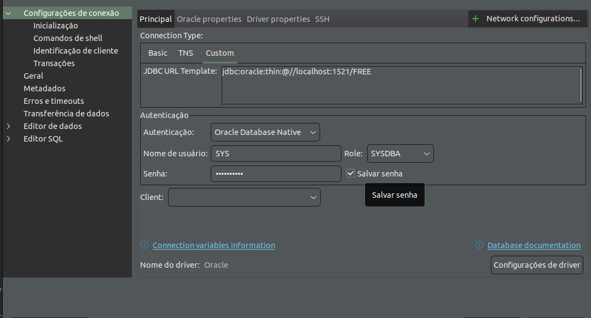

# Eclipse Starter for Jakarta EE

# Gerando projeto Jakarta EE: https://start.jakarta.ee/
This is a sample application generated by the Eclipse Foundation starter for Jakarta EE.

You can run the application by executing the following command from the directory where this file resides. Please ensure you have installed a [Java SE 8+ implementation](https://adoptium.net/?variant=openjdk8) appropriate for your Jakarta EE version and runtime choice (we have tested with Java SE 8, Java SE 11 and Java SE 17). Note, the [Maven Wrapper](https://maven.apache.org/wrapper/) is already included in the project, so a Maven install is not actually needed. You may first need to execute `chmod +x mvnw`.

```
./mvnw clean package tomee:run
```

Once the runtime starts, you can access the project at http://localhost:8080/jakartaee-hello-world.

Para instalar o Eclipse no Ubuntu utilizando o arquivo eclipse-jee-2024-06-R-linux-gtk-x86_64.tar.gz que você baixou, siga os passos abaixo:

Extraia o arquivo baixado:
Primeiro, abra o terminal e navegue até o diretório onde o arquivo foi baixado. Em seguida, extraia o conteúdo do arquivo com o seguinte comando:
```
tar -xvzf eclipse-jee-2024-06-R-linux-gtk-x86_64.tar.gz
```
Mover para o diretório /opt:
Para tornar o Eclipse disponível para todos os usuários, mova a pasta extraída para o diretório /opt:

```
sudo mv eclipse /opt/
```
Criar um link simbólico:
Para facilitar o acesso ao Eclipse, crie um link simbólico no /usr/local/bin:

```
sudo ln -s /opt/eclipse/eclipse /usr/local/bin/eclipse
```

Criar um atalho na área de trabalho:
Para criar um atalho no menu de aplicativos do Ubuntu, crie um arquivo .desktop:

```
sudo nano /usr/share/applications/eclipse.desktop
```

Cole o seguinte conteúdo no arquivo:

```
[Desktop Entry]
Name=Eclipse IDE
Type=Application
Exec=/opt/eclipse/eclipse
Terminal=false
Icon=/opt/eclipse/icon.xpm
Comment=Integrated Development Environment
NoDisplay=false
Categories=Development;IDE;
Name[en]=Eclipse IDE
```

### Dando permissão para o servidor Tomcat:
```
cd /home/leandro/Downloads/apache-tomcat-10.0.27/bin
```
    
    chmod +x catalina.sh
 

Salve e feche o editor.

Dar permissões de execução:
Torne o atalho executável com o comando:

```
sudo chmod +x /usr/share/applications/eclipse.desktop
```

### Criando container para database Oracle DB: Link  [Docker Hub oracle DB tutorial](https://medium.com/oracledevs/oracle-database-23c-free-developer-release-for-java-developers-with-docker-on-windows-b164a7a61a91)

#### 1. Apos instalação do cotainer, caso deseja entrar no container, execute o comando abaixo:
```
    docker exec -it <id_container> sh
```

#### 2. Para acessar o banco de dados Oracle, execute o comando abaixo:
```
    sqlplus / as sysdba
```

#### 3. Para criar um novo usuário, execute o comando abaixo:
```
    CREATE USER <nome_usuario> IDENTIFIED BY <senha>;
```

#### 4. Para conceder permissões ao usuário, execute o comando abaixo:
```
    GRANT CONNECT, RESOURCE, DBA TO <nome_usuario>;
```

#### 5. Conectando ao container pelo dbbeaver:



#### 6. auterando a senha do usuario sys no container Oracle DB:
```
    docker exec 54b3b9354e6f resetPassword <nova_senha>
```


